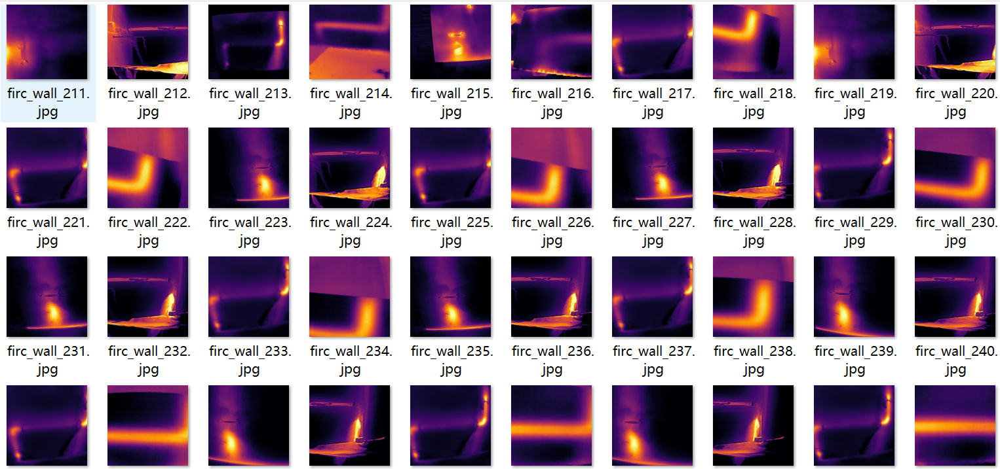
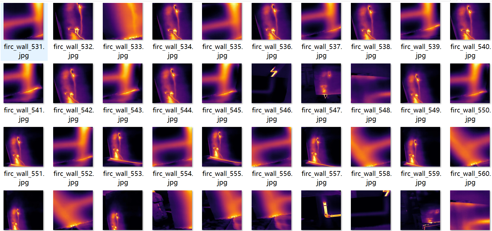
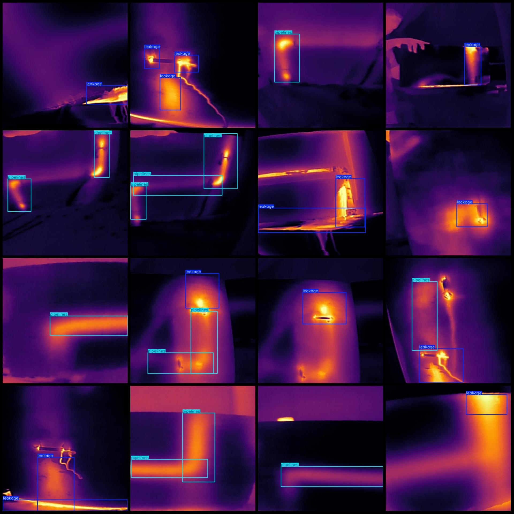
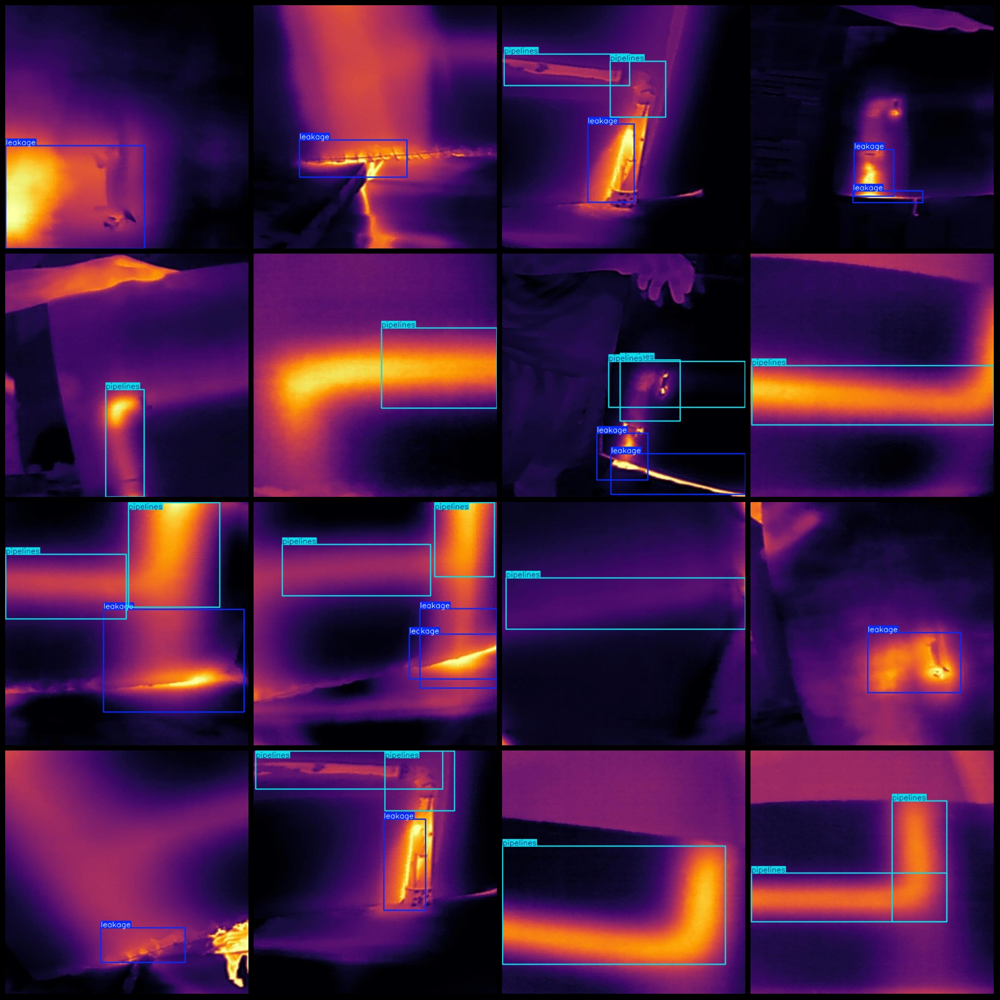

# Infrared Image Wall Internal Pipeline Leakage Water Detection Dataset - VOC+YOLO format - 945 images in 2 categories

Dataset Format: Pascal VOC format + YOLO format (txt files without split paths, only containing jpg images and corresponding VOC format xml files and yolo format txt files)
Number of images (number of jpg files): 945
Number of annotations (number of xml files): 945
Number of annotations (number of txt files): 945
Number of annotation categories: 2
Annotation category names (note that the order in the yolo format is not consistent with this, but based on the classes.txt file in the labels folder): ["leakage", "pipelines"]
Number of bounding boxes per category:
leakage (leakage) = 806
pipelines (pipelines) = 924
Total bounding boxes = 1730
Image resolution: 640x640
Labeling tool used: labelImg
Annotation rules: draw a box around the category
Important Notes: None
Special Disclaimer: This dataset does not guarantee the accuracy of the trained model or weight files
Preview:
## Image

Here is a pay link on Stripe ( https://buy.stripe.com/3cs8yP7sY87d0vu9AB ). Please contact me lonlonago@foxmail.com after funding $89, and I will send you a complete data files , thank you!

